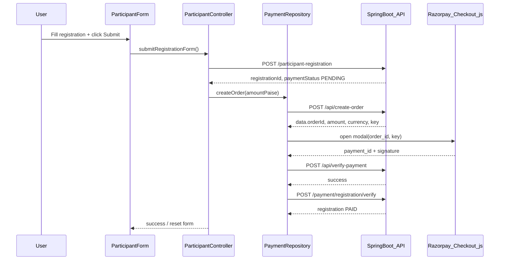

# Flutter Razorpay Registration Checkout Plan

## Context

| Layer | State |
|-------|-------|
| Backend | [`ApiPaymentController.java`](yoga-app-backend/src/main/java/com/example/school/payment/ApiPaymentController.java) exposes `POST /api/create-order` and `POST /api/verify-payment` (public, no JWT) |
| Flutter | Web-first app (`yoga_champ`); **no Razorpay code**; payment UI is placeholder in [`participant_registration_form_screen.dart`](yoga-app-frontend/lib/presentation/screens/participants/participant_registration_form_screen.dart) |
| Registration | [`participant_controller.dart`](yoga-app-frontend/lib/presentation/controllers/participant_controller.dart) hardcodes `paymentMode: 'ONLINE'` and submits immediately with no payment step |

**User choices:** participant registration checkout, **web only** (Razorpay Checkout.js — not `razorpay_flutter`).

---

## Architecture



### Why two verify calls?

`/api/verify-payment` marks `payment_transactions` as PAID but does **not** update `participant_registrations`. The existing domain endpoint [`POST /payment/registration/verify`](yoga-app-backend/src/main/java/com/example/school/payment/PaymentController.java) links the order to a `registrationId` and sets `paymentStatus = PAID`.

**Flutter plan:** call both in sequence after checkout success (signature verified twice — harmless/idempotent).

**Optional backend follow-up (not in this Flutter plan):** extend `/api/verify-payment` to accept optional `registrationId` and delegate to `RegistrationPaymentService` so Flutter only needs one verify call.

---

## Registration flow (Model 3 — online only)

Backend enforces Model 3 (`PAY_PER_PARTICIPANT`) as online-only in [`RegistrationPaymentService`](yoga-app-backend/src/main/java/com/example/school/payment/RegistrationPaymentService.java). Flutter should gate the Razorpay UI on:

- `competition.paymentModel == 'PAY_PER_PARTICIPANT'` (field exists on backend [`CompetitionDto`](yoga-app-backend/src/main/java/com/example/school/competition/CompetitionDto.java) but **not yet parsed** in Flutter [`competition_model.dart`](yoga-app-frontend/lib/data/models/competition_model.dart))
- `categoryAmounts[categoryId] > 0`
- `registrationOpen == true` (if exposed on competition API)

Models 1 & 2 (GPay/Cash + proof upload) remain a **later phase** — this plan replaces the placeholder only for the online path.

### Pay-after-register sequence

1. Validate form (existing logic in `submitRegistrationForm`)
2. `POST /participant-registration` → capture `registrationId` from response
3. Compute `amountPaise = (categoryAmounts[categoryId] * 100).round()` (minimum 100)
4. `POST /api/create-order` with `{ amount, currency: "INR", receipt: "reg_{registrationId}" }`
5. Open Razorpay Checkout.js using returned `data.orderId`, `data.amount`, `data.key`
6. On `handler` success → `POST /api/verify-payment` with three Razorpay fields
7. On verify success → `POST /payment/registration/verify` with same three fields + `registrationId`
8. Show success toast and reset form (existing behavior)

If user dismisses modal or `payment.failed` fires → show error, registration stays `PENDING` (admin can handle or user retries payment later).

---

## Files to create

| File | Purpose |
|------|---------|
| [`lib/data/models/payment_order_model.dart`](yoga-app-frontend/lib/data/models/payment_order_model.dart) | Parse `data` object from create-order: `{ orderId, amount, currency, key }` |
| [`lib/data/models/payment_verify_result.dart`](yoga-app-frontend/lib/data/models/payment_verify_result.dart) | Parse `data` object from verify: `{ orderId, paymentId, transactionId }` |
| [`lib/data/repositories/payment_repository.dart`](yoga-app-frontend/lib/data/repositories/payment_repository.dart) | HTTP calls to payment endpoints |
| [`lib/services/razorpay_checkout_service.dart`](yoga-app-frontend/lib/services/razorpay_checkout_service.dart) | Abstract checkout interface |
| [`lib/services/razorpay_checkout_web.dart`](yoga-app-frontend/lib/services/razorpay_checkout_web.dart) | Web impl via `dart:js_interop` + Checkout.js |
| [`lib/presentation/controllers/payment_controller.dart`](yoga-app-frontend/lib/presentation/controllers/payment_controller.dart) | GetX controller: loading state, errors, orchestrates repo + checkout |
| [`lib/presentation/widgets/registration_payment_section.dart`](yoga-app-frontend/lib/presentation/widgets/registration_payment_section.dart) | Replaces placeholder: amount display, pay status, error banner |

No new pub dependency required for web — use built-in `dart:js_interop` (SDK `^3.9.2`). Do **not** add `razorpay_flutter` (web-only scope).

---

## Files to modify

| File | Change |
|------|--------|
| [`web/index.html`](yoga-app-frontend/web/index.html) | Add `<script src="https://checkout.razorpay.com/v1/checkout.js"></script>` before `flutter_bootstrap.js` |
| [`lib/core/constants/app_constants.dart`](yoga-app-frontend/lib/core/constants/app_constants.dart) | Add `EndPoints.createOrder = '/api/create-order'`, `verifyPayment = '/api/verify-payment'`, `registrationPaymentVerify = '/payment/registration/verify'` |
| [`lib/data/models/competition_model.dart`](yoga-app-frontend/lib/data/models/competition_model.dart) | Parse `paymentModel`, `registrationOpen` from competition API |
| [`lib/presentation/screens/participants/participant_registration_form_screen.dart`](yoga-app-frontend/lib/presentation/screens/participants/participant_registration_form_screen.dart) | Replace `_buildPaymentModeSection()` with `RegistrationPaymentSection` |
| [`lib/presentation/controllers/participant_controller.dart`](yoga-app-frontend/lib/presentation/controllers/participant_controller.dart) | Split submit into register-then-pay; inject `PaymentController`; remove unconditional `paymentMode: 'ONLINE'` hardcode |
| [`ApiPaymentController.java`](yoga-app-backend/src/main/java/com/example/school/payment/ApiPaymentController.java) | Wrap responses in standard `{ success, message, data }` envelope (see below) |

---

## Implementation details

### 0. Backend — normalize API response envelope (prerequisite)

[`ApiPaymentController.java`](yoga-app-backend/src/main/java/com/example/school/payment/ApiPaymentController.java) currently returns flat fields (`order_id`, `amount`, `key` at top level). Update to match the envelope used across the app — same pattern as [`ParticipantRegistrationController`](yoga-app-backend/src/main/java/com/example/school/participantregistration/ParticipantRegistrationController.java) and [`PaymentController`](yoga-app-backend/src/main/java/com/example/school/payment/PaymentController.java):

**Success:**
```json
{
  "success": true,
  "message": "Order created successfully",
  "data": {
    "orderId": "order_xxx",
    "amount": 50000,
    "currency": "INR",
    "key": "rzp_test_...",
    "transactionId": 42,
    "mockMode": false
  }
}
```

**Verify success:**
```json
{
  "success": true,
  "message": "Payment verified successfully",
  "data": {
    "orderId": "order_xxx",
    "paymentId": "pay_xxx",
    "transactionId": 42
  }
}
```

**Error (400/401/500):**
```json
{
  "success": false,
  "message": "Invalid payment signature"
}
```

Changes in `ApiPaymentController`:
- Move order/verify payload fields into a `data` map
- Use **camelCase** keys in `data` (`orderId`, `paymentId`) to align with [`PaymentOrderService`](yoga-app-backend/src/main/java/com/example/school/payment/PaymentOrderService.java) and Flutter models
- Keep Razorpay **request** field names as snake_case (`razorpay_order_id`, etc.) — that is Razorpay's contract
- Remove top-level `order_id` / `amount` / `key` duplication

[`APIService._parseResponse`](yoga-app-frontend/lib/services/api_service.dart) on 2xx responses without a `status` field calls `fromJson(data)` when `data` is present — so the normalized envelope works with zero special-case parsing.

### 1. Payment repository

Follow existing repo pattern (instantiate `APIService`, use `EndPoints`). **No custom response-shape handling** — same as [`ParticipantRepository`](yoga-app-frontend/lib/data/repositories/participant_repository.dart):

```dart
final response = await _apiService.getResponse<PaymentOrderModel>(
  url: EndPoints.createOrder,
  apiType: APIType.aPost,
  body: { 'amount': amountPaise, 'currency': 'INR', 'receipt': receipt },
  fromJson: (json) => PaymentOrderModel.fromJson(json as Map<String, dynamic>),
);

if (!response.success || response.data == null) {
  throw Exception(response.message ?? 'Failed to create order');
}
return response.data!;
```

```dart
// createOrder
POST /api/create-order
body: { "amount": 50000, "currency": "INR", "receipt": "reg_123" }
// response.data → PaymentOrderModel

// verifyPayment
POST /api/verify-payment
body: { "razorpay_order_id", "razorpay_payment_id", "razorpay_signature" }
// response.data → PaymentVerifyResult

// linkRegistration (domain — already uses { success, data })
POST /payment/registration/verify
body: { above three fields + "registrationId": 123 }
```

`KEY_SECRET` never appears in Flutter — only `key` (Key ID) from `response.data.key`.

### 2. Razorpay Checkout.js bridge (web)

In `razorpay_checkout_web.dart`:

- Define `@JS()` external class `Razorpay` with `external Razorpay(JSObject options)` and `external void open()`
- Build options object: `key`, `amount`, `currency`, `order_id`, `name` (app name), `description`, `handler` callback
- `handler` receives `razorpay_payment_id`, `razorpay_order_id`, `razorpay_signature` → complete `Future` returned to Dart
- Listen for modal close / `payment.failed` via Razorpay `modal.ondismiss` and `ondismiss` option → throw user-cancelled error
- Wrap in `Completer` for async Dart API: `Future<PaymentCheckoutResult> openCheckout(PaymentOrderModel order)`

Reference: [Razorpay Standard Checkout integration](https://razorpay.com/docs/payments/payment-gateway/web-integration/standard/integration-steps/)

### 3. UI — registration payment section

Replace placeholder comments in `_buildPaymentModeSection`:

- Show **category fee** from `CompetitionController.categoryAmounts[categoryId]` (updates when category changes)
- Show **payment status chip**: Not started / Processing / Paid / Failed
- Disable submit while payment in progress
- For non-Model-3 competitions: show "Manual payment (GPay/Cash) — coming soon" or hide Razorpay block (do not break Models 1/2 submit)

### 4. Controller changes

In `submitRegistrationForm`:

```
if (isOnlinePaymentRequired) {
  final regId = await createRegistration(...);
  final amountPaise = computeAmount(...);
  final order = await paymentRepo.createOrder(...);
  final checkout = await razorpayService.openCheckout(order);
  await paymentRepo.verifyPayment(checkout);
  await paymentRepo.linkRegistrationPayment(regId, checkout);
  return true;
} else {
  // existing create-only path for manual models (future)
}
```

Add state on `ParticipantController` or `PaymentController`:
- `RxBool isPaymentInProgress`
- `RxString paymentError`
- `RxnString lastRegistrationId` (for retry)

### 5. Error handling

| Event | Flutter behavior |
|-------|------------------|
| `amount < 100` paise | Block pay; show "Invalid fee for category" |
| create-order 400/401/500 | Show `message` from response |
| User closes modal | "Payment cancelled" — registration remains PENDING |
| `payment.failed` | Show Razorpay error description |
| verify 400 (bad signature) | Show "Payment verification failed" — do not mark paid |
| Network timeout | Retry prompt |

---

## Environment and config

| Item | Where |
|------|-------|
| Backend Razorpay keys | Backend `.env` (`RAZORPAY_KEY_ID`, `RAZORPAY_KEY_SECRET`) — already set up |
| Flutter Key ID | **Not in frontend env** — returned per order in `response.data.key` |
| API base URL | Existing [`AppConfig.baseUrl`](yoga-app-frontend/lib/config/app_config.dart): dev `http://localhost:8080`, QA/prod via `main_qa.dart` / `main_prod.dart` |

No frontend `.env` needed for Razorpay.

---

## Testing plan

1. **Backend:** `set -a && source .env && set +a && mvn spring-boot:run` with `RAZORPAY_ENABLED=true`
2. **Flutter:** `flutter run -d chrome` (dev entrypoint → `localhost:8080`)
3. Open participant registration for a **Model 3** competition with `categoryAmounts` configured
4. Fill form → Submit → Razorpay test modal opens
5. Pay with Razorpay test card (`4111 1111 1111 1111`, any future expiry, any CVV)
6. Confirm: `/api/verify-payment` returns success, registration shows `paymentStatus: PAID`
7. Negative tests: dismiss modal, wrong signature (mock), amount below 100 paise

---

## Out of scope (follow-up)

- `razorpay_flutter` for Android/iOS
- Models 1 & 2 manual GPay/Cash + proof upload UI
- Org subscription checkout (`/payment/subscription/*`)
- Competition maintenance fee on create (`/payment/competition/*/maintenance-order`)
- Consolidating dual verify into single `/api/verify-payment` backend call
